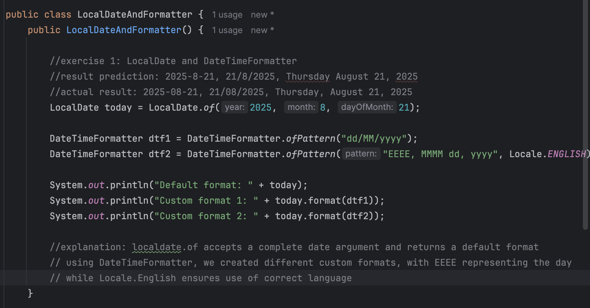
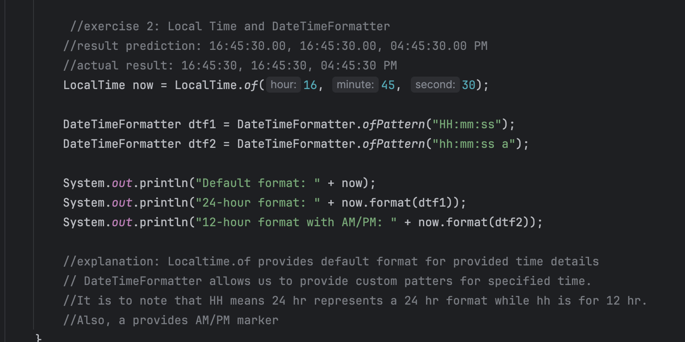
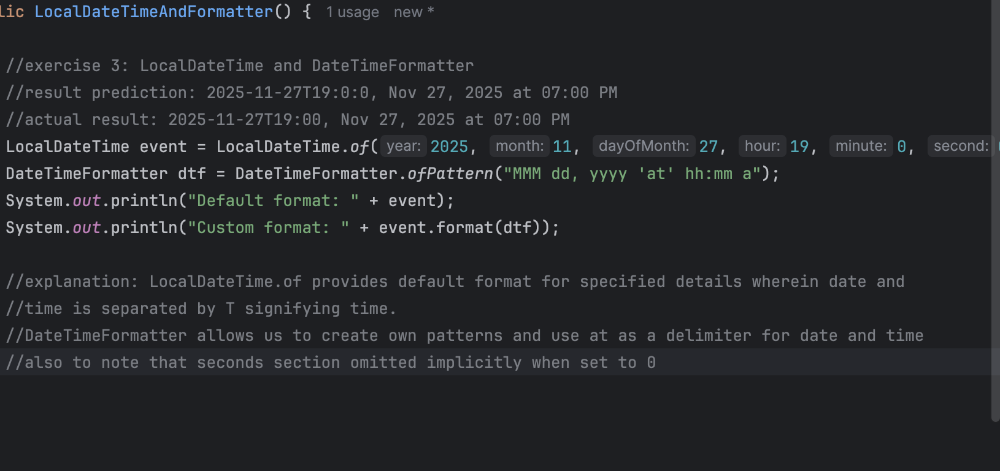
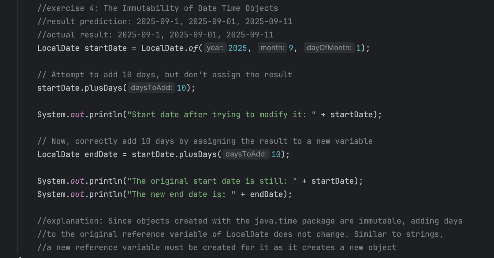
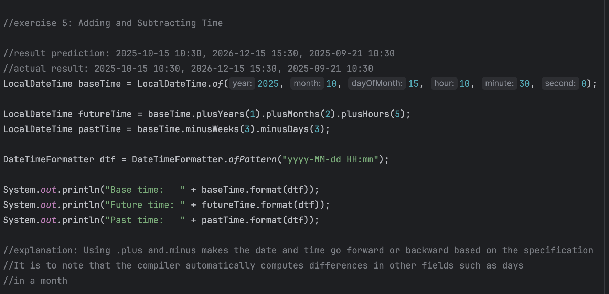
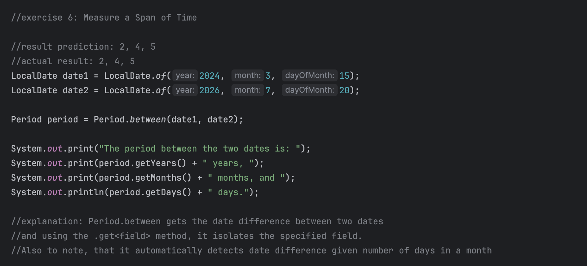

# Lab: Exploring Java DateTime

### by: Ivan Patrick Frondozo

## Description: 

This is a Java program that explores the functionalities of the java.time package by predicting results of different methods and use cases of such methods.

## Output:

### Exercise 1: LocalDate and DateTimeFormatter

### Exercise 2: LocalTime and DateTimeFormatter

### Exercise 3: LocalDateTime and DateTimeFormatter

### Exercise 4: The Immutability of Date Time Objects

### Exercise 5: Adding and Subtracting Time (plus and minus)

### Exercise 6: Period - Measuring a Span of Time

